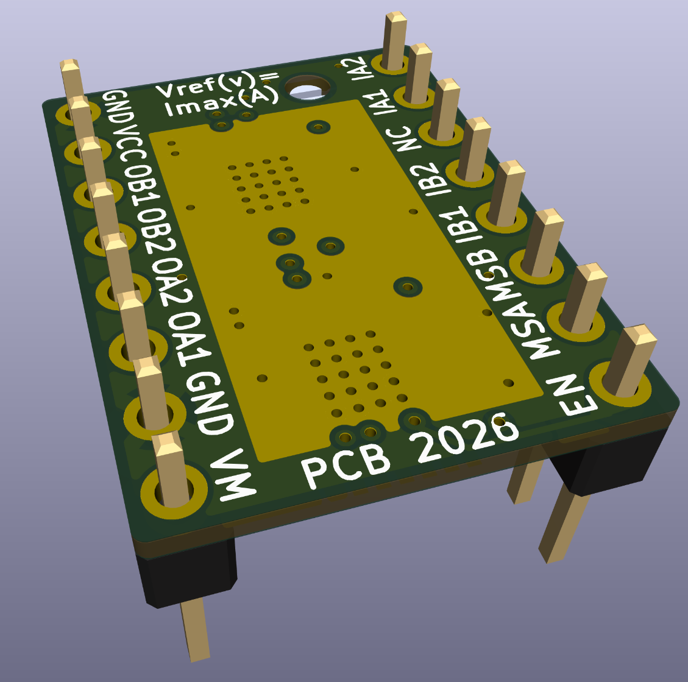
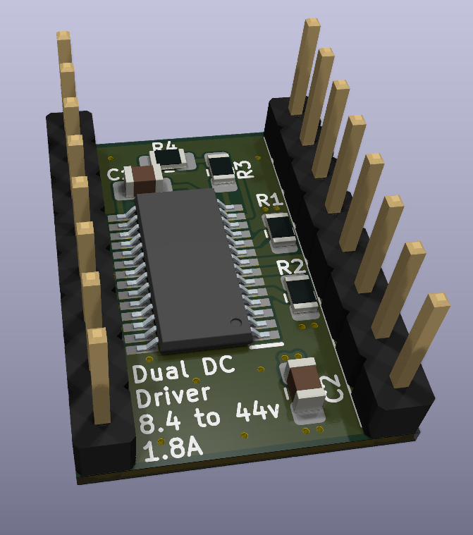
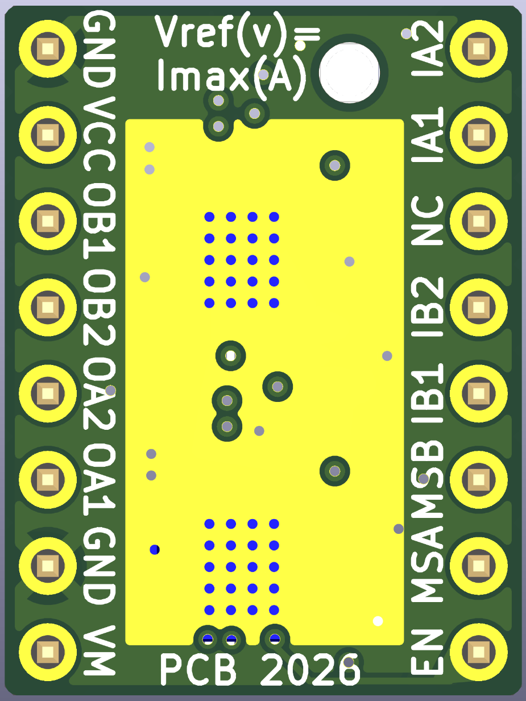

# StepStick DC Driver
A dual DC/H-bridge driver, designed as a drop-in replacement for a standard stepstick.  
Designed around the `TB67H481FNG` IC. Datasheets can be found [here](Components/TB67H481FNG/).

## Specs
- Dual H-Bridge : Can drive two DC loads in both directions
- 1.8A Max per channel
- Accepts an input power voltage between 8.4 and 44v
- Based around a 4 layer PCB, to improve heat dissipation (a heat sink and active cooling is highly recommended)
- A maximum intensity can be configured with the `MS1` and `MS2` pins
- Can be enabled or disabled with the `en` pin, just like a standard stepstick
- Compatible with both 5v and 3.3v logic voltage

## Pinout

You can use the `Pololu_Breakout_A4988` symbol from the default KiCad library, with its accompanying default footprint. Here is a pinout correspondence for the pins :

| StepStick DC Driver | Pololu A4988 |
|:-------------------:|:------------:|
|         OB1         |      1B      |
|         OB2         |      1A      |
|         OA2         |      2A      |
|         OA1         |      2B      |
|         IA1         |      DIR     |
|         IA2         |     STEP     |
|         IB1         |     RESET    |
|         IB2         |      MS3     |
|          NC         |  VDD, SLEEP  |

> [!WARNING]
> You need to add a 100uf capacitor between the `VM` and `GND` pins.

## Configuration
If the resistors on the BOM are respected, the maximum intensity per channel can be configured with the `MS1` and `MS2` pins :

| MS1 | MS2 | Torque            | Max current per channel   |
|:---:|:---:|:-----------------:|:-------------------------:|
|  L  |  L  | 100%              | 1.8A                      |
|  L  |  H  | 71%               | 1.3A                      |
|  H  |  L  | 38%               | .7A                       |
|  H  |  H  | 0% (Output OFF)   | 0A                        |

If left open, a pin will be pulled down (considered L).
The configuration is the same for both channels.  

## Control
Channel A and B are both controlled by their own two pins Ix1 and Ix2 :

| Ix1 | Ix2 | Ox1 | Ox2 |       Mode       |
|:---:|:---:|:---:|:---:|:----------------:|
|  L  |  L  |  L  |  L  |    Short Brake   |
|  L  |  H  |  L  |  H  | Counterclockwise |
|  H  |  L  |  H  |  L  |     Clockwise    |
|  H  |  H  |  H  |  H  |    Short brake   |

If left open, a pin will be pulled down (considered L).
If you do not want to use one of the channels, you can simply not connect the output to anything.

## Fabrication notes
The constraints have been set up for Aisler's Beautiful Boards service.  
It is advised to use a .8mm total thickness instead of the standard 1.6mm to improve the thermal dissipation.

## Real world testing
To be done.
